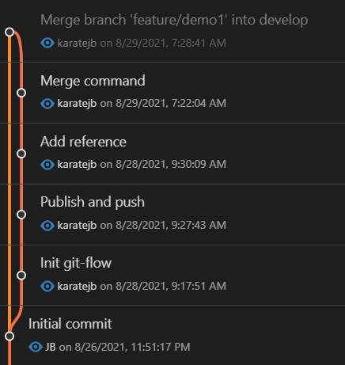
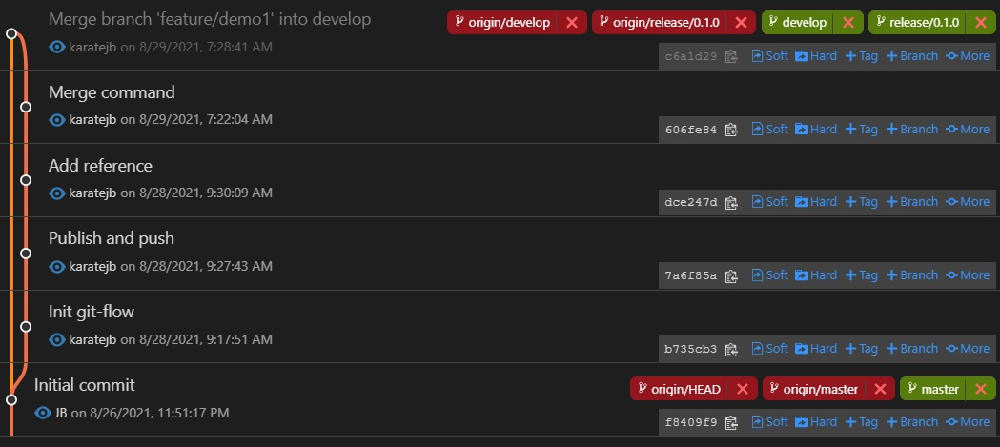
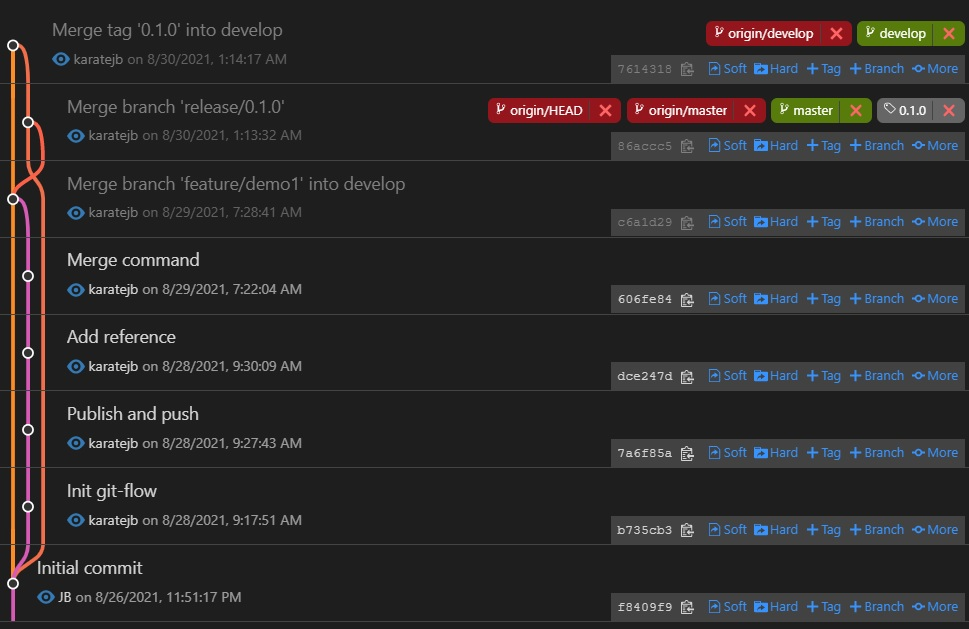
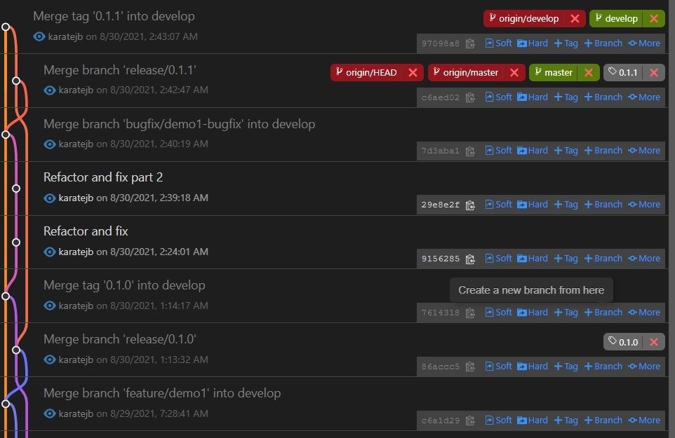

# GitFlow.Practice

---
## Init

```s
$ git flow init
```

The default branch stratrgy:

| Branch name/prefix | Description |
|:------------------:|:------------|
| `master` | Production releases. |
| `develop` | Next release development. |
| `feature/` | Feature branches |
| `bugfix/` | Bugfix branches |
| `release/` | Release branches |
| `hotfix/` | Hotfix branches |
| `support/` | Support branches |


Then sync with a remote repository (optionaly) by

```s
$ git remote add origin git@github.com:<id>/<repository>
```


---
## Feature development


### Create a feature Branch based on develop branch

```s
$ git flow feature start <my_branch>
```

Or by

```s
$ git checkout -b feature/<my_branch> develop
```


### Track and push to remote

After saving changes to local repository, we can push the commit(s) to remote by,

```s
$ git flow feature publish <my_branch>
```

Or

```s
$ git push --set-upstream origin feature/<my_branch>
```

After that we can push commit(s) with `git push`.


### Checkout an exist branch and pull

```s
$ git flow feature pull origin <my_branch>
```

Or

```s
$ git checkout feature/<my_branch>
$ git pull --rebase
```


### Merge to develop branch

```s
$ git checkout develop
$ git pull --rebase
$ git flow feature finish <my_branch>
$ git push
```

Or

```s
$ git checkout develop
$ git pull --rebase

# Merge feature branch to develop branch without fast-forward
$ git merge --no-ff feature/<my_branch>
$ git push
$ git branch -d feature/<branch>
$ git push origin -d feature/<branch> 
```


After merging the feature branch to develop branch, the git history is like:




***
## Start A Release

### Create a release branch based on develop branch

```s
$ git flow release start <name_or_version> [base]
```

The optional argument, `[base]`, must be the commit hash code on the `develop` branch.


For example,

```s
$ git flow release start 0.1.0
```


### Track and push to remote

```s
$ git flow release publish 0.1.0
```


If you wanna to checkout and pull an exist release branch:

```s
git flow release pull origin 0.1.0
```

So far we get the git history like this:




### Finish the release

```s
$ git flow release finish 0.1.0
```

The command will do the actions:

- Release branch 'release/0.1.0' has been merged into 'master'
- The release was tagged '0.1.0' (annotated tag with name as the release branch name)
- Release tag '0.1.0' has been back-merged into 'develop'
- Release branch 'release/0.1.0' has been locally deleted; it has been remotely deleted from 'origin'
- You are now on branch 'develop'


In other words, the `git flow release finish <release_branch>` command executes:

```s
$ git checkout master
$ git merge --no-ff release/0.1.0
$ git tag -a 0.1.0
$ git checkout develop
$ git merge --no-ff release/0.1.0
$ git branch -d release/0.1.0
$ git push origin -d release/0.1.0
```


After finishing up the release, don't forget to update the remote by:

```s
# Push to remote develop branch
$ git push
# Checkout master and push commits and annotated tag
$ git checkout master
$ git push --follow-tags
```


Now the git history is as follwoing.




***
## Bug Fixing

The flow of `bugfix` is similar with `feature`. Let's go through the flow quickly.


```s
# Create bugfix branch
$ git flow bugfix start <my_branch>

# Track and push
$ git flow bugfix publish <my_branch>

# Merge to develop branch
$ git flow bugfix finish <my_branch>

# Push develop branch
$ git push

# Create release branch, track and push to remote
$ git flow release start 0.1.1
$ git flow release publish 0.1.1

$ Finish release
$ git flow release finish 0.1.1
$ git push
$ git checkout master
$ git push --follow-tags
```

The result:




***
## Hotfix

### Create a Hotfix branch

```s
$ git flow hotfix start <name_or_version> [base]
```

For example,

```s
$ git flow hotfix start 0.1.2
```


### Track and push to remote

```s
$ git flow hotfix publish 0.1.2
```

Or checkout and pull the exist hotfix branch from remote:

```s
git flow hotfix pull origin 0.1.2
```


### Finish the Hotfix

The behavior of `git flow hotfix finish` is similar with `git flow release finish`.


```s
$ git flow hotfix finish 0.1.2
```


***
## References

- [git-flow cheetsheet](https://danielkummer.github.io/git-flow-cheatsheet/)

